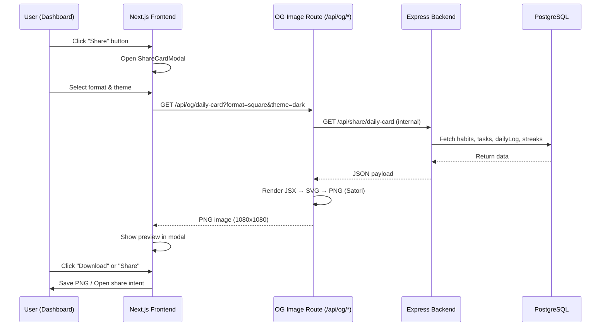

# 🎨 LifeOS Social Share — Shareable Daily Achievement Cards

> Fitur yang memungkinkan user generate gambar/carousel visual yang premium & gen-z aesthetic dari data produktivitas harian mereka, siap di-share ke Instagram Story, Twitter/X, atau WhatsApp.

## Background & Motivation

Tren "productivity flex" di social media sangat populer — orang suka share streak, completed tasks, dan mood journal mereka. LifeOS sudah punya semua data yang dibutuhkan (habits, tasks, streaks, mood, daily log). Kita tinggal render data itu jadi visual card yang cantik.

## User Review Required

> [!IMPORTANT]
> **Pilihan teknologi render gambar:**
> Kita punya 2 opsi untuk generate gambar di sisi server:
> 1. **`@vercel/og` (Satori + Resvg)** — React JSX → SVG → PNG. Ringan, edge-compatible, sudah well-integrated dengan Next.js.
> 2. **Canvas API (node-canvas)** — Raw pixel rendering. Lebih fleksibel tapi lebih berat & ribet.
>
> **Rekomendasi: Opsi 1 (`@vercel/og`)** karena bisa pakai JSX syntax (familiar), ringan, dan sudah proven di production.

> [!IMPORTANT]
> **Format share yang diinginkan:**
> - **Single Card** (1080x1080 px) — cocok untuk Instagram feed & Twitter
> - **Story Card** (1080x1920 px) — cocok untuk IG Story & WhatsApp Status
> - **Carousel (multi-slide)** — beberapa card yang bisa di-slide (generate 2-4 gambar sekaligus)
>
> Semua format di atas akan diimplementasi. User bisa pilih saat generate.

## Open Questions

> [!IMPORTANT]
> 1. **Branding**: Apakah ingin ada watermark "LifeOS" atau logo di setiap card yang di-share?
> 2. **Privacy**: Data apa saja yang boleh di-share? Semua (habits, tasks, mood, journal) atau ada yang harus di-exclude (misalnya journal pribadi)?
> 3. **Theme/Color**: Mau support multiple theme (dark gradient, neon glow, pastel, etc.) atau satu theme elegan saja?
> 4. **Telegram Integration**: Mau bisa generate card langsung dari Telegram bot juga (misal `/share`) atau cukup dari web dashboard dulu?

---

## Proposed Changes

### Component 1: Backend API — Share Card Generator

Summary: Membuat endpoint API baru yang menerima request dari frontend, mengambil data user dari database, dan mengembalikan data terstruktur untuk rendering.

---

#### [NEW] [shareController.ts](file:///c:/Users/Nurikhsan/Documents/project/lifeos/src/controllers/shareController.ts)

Controller baru yang menangani logika pengambilan data untuk share card:

```typescript
// Endpoint: GET /api/share/daily-card?format=square|story|carousel
// - Mengambil data: habits (done/total), tasks (done/total), streak terpanjang,
//   mood, energy, focus score, dan highlights dari daily log
// - Mengembalikan JSON terstruktur untuk rendering
// - Otomatis menghitung "achievement badges" (misal: "🔥 Perfect Day" jika semua habit done)
```

Data payload yang disiapkan:

| Field | Source | Contoh |
|---|---|---|
| `date` | `new Date()` | "Jumat, 8 Agustus 2026" |
| `userName` | `User.name` | "Nurikhsan" |
| `habitsCompleted` | `HabitLog` count (DONE) | 5/6 |
| `tasksCompleted` | `Task` count (DONE) | 8/12 |
| `focusScore` | Analytics | 87% |
| `topStreak` | `calculateHabitStreak()` | { name: "Olahraga", streak: 14 } |
| `mood` | `DailyLog.mood` | 4 (🙂) |
| `energy` | `DailyLog.energy` | 4 |
| `achievements` | Computed | ["Perfect Habits", "7-day Streak"] |
| `highlights` | `DailyLog.highlights` | ["Finished project proposal"] |
| `quote` | Optional motivational | "Consistency beats intensity" |

---

#### [MODIFY] [server.ts](file:///c:/Users/Nurikhsan/Documents/project/lifeos/src/server.ts)

- Register route baru: `GET /api/share/daily-card`
- Import `shareController`

---

### Component 2: Next.js OG Image Route — Server-side Image Rendering

Summary: Menggunakan Next.js `ImageResponse` (dari `@vercel/og`) untuk render JSX menjadi gambar PNG langsung dari route handler.

---

#### [NEW] [app/api/og/daily-card/route.tsx](file:///c:/Users/Nurikhsan/Documents/project/lifeos/app/api/og/daily-card/route.tsx)

Next.js Route Handler yang render gambar via `ImageResponse`:

```
GET /api/og/daily-card?format=square&theme=dark
```

**Design specs untuk setiap format:**

**1. Square Card (1080×1080):**
```
┌─────────────────────────────────────┐
│  ✨ DAILY ACHIEVEMENT              │
│  Jumat, 8 Agustus 2026             │
│                                     │
│  ┌─────────┐  ┌─────────┐         │
│  │ 🎯 5/6  │  │ ✅ 8/12 │         │
│  │ Habits   │  │ Tasks   │         │
│  └─────────┘  └─────────┘         │
│                                     │
│  ⭐ Focus Score: 87%               │
│  ████████████████░░░░               │
│                                     │
│  🔥 Best Streak: Olahraga (14d)   │
│  😊 Mood: Baik  ⚡ Energy: 4/5    │
│                                     │
│  ── Highlight ──                    │
│  "Finished the project proposal"    │
│                                     │
│              lifeos.app      ⚡     │
└─────────────────────────────────────┘
```

**2. Story Card (1080×1920):**
- Layout vertikal dengan spacing lebih lega
- Gradient background (dark purple → deep blue)
- Animasi-style glow effects pada angka utama
- Bagian bawah: motivational quote + branding

**3. Carousel (set of 2-4 cards):**
- Slide 1: Overview (habits + tasks + focus score)
- Slide 2: Streak breakdown per habit
- Slide 3: Mood & energy trend (mini chart visual)
- Slide 4: Highlights & reflection

**Visual Design Language:**
- Background: Deep dark gradients (`#0a0a0f` → `#1a0a2e` → `#0d1117`)
- Accent: Neon glow effects (indigo, emerald, amber — matching existing theme)
- Typography: Inter/Geist font, bold numbers, clean hierarchy
- Glass-morphism containers for each stat section
- Subtle noise texture overlay untuk depth
- Rounded corners, consistent 16px–24px padding

---

#### [NEW] [app/api/og/streak-card/route.tsx](file:///c:/Users/Nurikhsan/Documents/project/lifeos/app/api/og/streak-card/route.tsx)

Dedicated card untuk flex streak tertentu:
```
GET /api/og/streak-card?habitId=xxx
```

Visual: Full-screen card fokus pada satu habit dengan "🔥 14 DAYS" besar di tengah, history bar di bawah.

---

### Component 3: Frontend — Share Modal & Preview

Summary: Modal baru di dashboard yang menampilkan preview card, pilihan format, dan tombol download/share.

---

#### [NEW] [ShareCardModal.tsx](file:///c:/Users/Nurikhsan/Documents/project/lifeos/app/dashboard/components/modals/ShareCardModal.tsx)

Modal component dengan fitur:

1. **Format Selector** — Tab/toggle: Square | Story | Carousel
2. **Theme Selector** — Pilihan warna: Dark Neon | Midnight Purple | Ocean Blue | Sunset Warm
3. **Live Preview** — Render `` dari OG route dengan query params
4. **Content Toggle** — Checkbox untuk include/exclude: Habits, Tasks, Mood, Highlights
5. **Download Button** — Download PNG langsung (`fetch` → `blob` → `saveAs`)
6. **Share Buttons** — Quick share ke:
   - 📋 Copy to Clipboard
   - 🐦 Twitter/X (pre-filled text + image)
   - 📱 Instagram (download + instruksi)
   - 💬 WhatsApp (share link)
   - 📲 Telegram (share ke self/channel)

UI akan menggunakan glassmorphism dan animasi yang konsisten dengan design system existing.

---

#### [MODIFY] [TopBar.tsx](file:///c:/Users/Nurikhsan/Documents/project/lifeos/app/dashboard/components/TopBar.tsx)

- Tambahkan tombol "📤 Share" dengan icon `Share2` dari lucide-react
- Tombol ini trigger `onOpenShareModal()` callback

---

#### [MODIFY] [page.tsx](file:///c:/Users/Nurikhsan/Documents/project/lifeos/app/dashboard/page.tsx)

- State baru: `isShareModalOpen`
- Import & render `<ShareCardModal />`
- Pass data yang dibutuhkan (habits, tasks, analytics, dailyLog)

---

### Component 4: Telegram Bot Integration (Optional/Phase 2)

Summary: Command `/share` di Telegram bot yang generate card dan kirim langsung sebagai foto.

---

#### [MODIFY] [server.ts](file:///c:/Users/Nurikhsan/Documents/project/lifeos/src/server.ts) (Phase 2)

- Register command `/share` di bot
- Handler: fetch OG image route → `ctx.replyWithPhoto({ url: ogUrl })`
- User bisa langsung forward ke story/group

---

### Component 5: Package Dependencies

---

#### [MODIFY] [package.json](file:///c:/Users/Nurikhsan/Documents/project/lifeos/package.json)

```diff
  "dependencies": {
+   "@vercel/og": "^0.6.0",
    ...
  }
```

`@vercel/og` sudah include Satori + Resvg. Tidak perlu install tambahan.

---

## Architecture Flow



---

## Visual Theme Options (Preview)

| Theme | Background | Accent | Vibe |
|---|---|---|---|
| **Dark Neon** | `#09090b` → `#1a0a2e` | Indigo + Emerald glow | Cyberpunk, techy |
| **Midnight Purple** | `#0d0015` → `#1a0033` | Purple + Pink gradients | Aesthetic, dreamy |
| **Ocean Blue** | `#0a1628` → `#0d2847` | Blue + Teal highlights | Clean, professional |
| **Sunset Warm** | `#1a0a00` → `#2d1500` | Amber + Orange glow | Warm, energetic |

---

## Verification Plan

### Automated Tests
```bash
# Test OG route returns valid PNG
curl -o test_card.png "http://localhost:3011/api/og/daily-card?format=square&theme=dark"
file test_card.png  # Should output: PNG image data, 1080 x 1080

# Test backend data endpoint
curl "http://localhost:3000/api/share/daily-card" -H "Authorization: Bearer <token>"
```

### Manual Verification
- Buka dashboard → klik tombol Share → preview card di modal
- Download card → buka di image viewer → cek resolusi & kualitas
- Share ke Twitter/WhatsApp → pastikan gambar muncul dengan benar
- Test semua 4 theme & 3 format
- Test di mobile responsive view
- Verify gambar render dengan data real dari database
